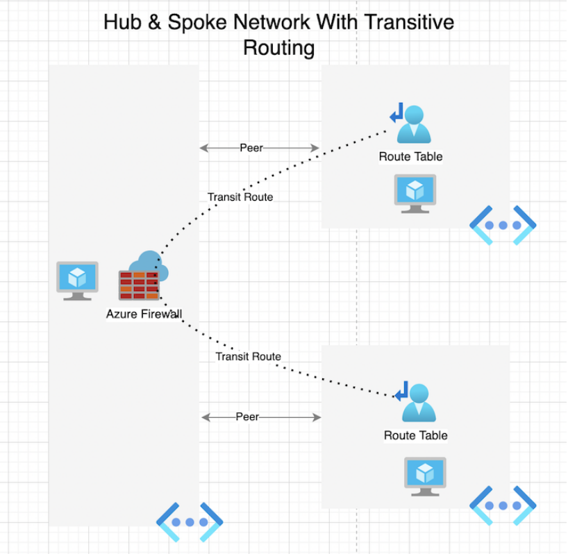

# 🌐 Azure Firewall to Route Spoke Vnets Through Hub Vnet

## 📖 Project Overview

This project demonstrates how to configure and manage an Azure **Hub-and-Spoke network topology** using **Terraform**, with focus on:

- **Custom routing using Azure Route Tables and User Defined Routes (UDR)**
- **Redirecting all VM traffic through an Azure Firewall**
- **Enabling secure communication between spoke virtual networks (VNets)**

The setup ensures centralized control of traffic, improved network security, and VM-to-VM connectivity across isolated spokes via a secured hub.

---

## 🧱 Architecture

The infrastructure includes:

- **1 Hub VNet**:  
  - Hosts the **Azure Firewall**
  - Contains a **Bastion Host** for secure VM access  
- **2 Spoke VNets**:  
  - Each contains:
    - A dedicated **subnet**
    - A **Linux Virtual Machine** running a web app  
- **VNet Peerings**:  
  - Between each spoke and the hub  
- **Azure Route Tables with UDRs**:  
  - Each spoke routes traffic to the **private IP of the Azure Firewall**  
  - Ensures forced tunneling for **egress traffic**

---

## 🔧 Features

✅ Deploy full hub-spoke topology using Terraform  
✅ Configure custom route tables for each spoke  
✅ Redirect outbound traffic through the Azure Firewall  
✅ Enable bidirectional communication between VMs across spokes 

